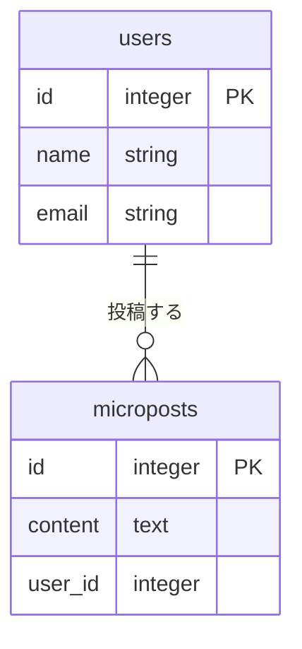

```mermaid
erDiagram
  users ||--o{ microposts: "投稿する"

  users {
    id integer PK
    name string
    email string
  }
  microposts {
    id integer PK
    content text
    user_id integer
  }
```
